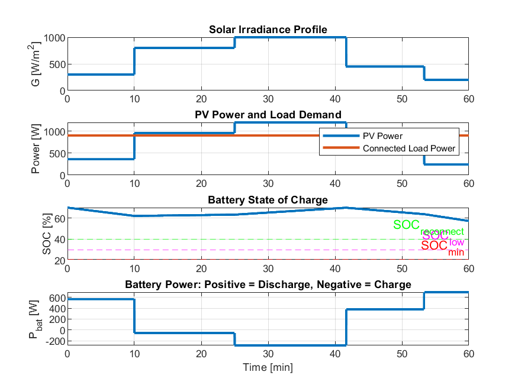
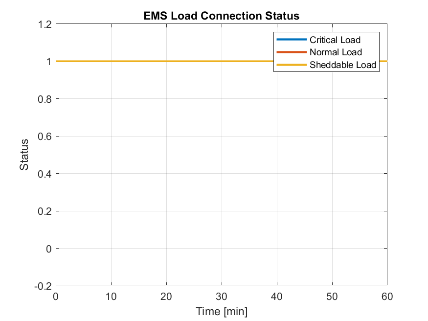
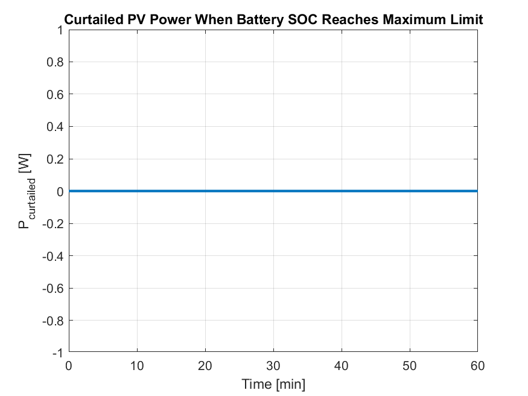

# Space Microgrid Energy Management System

This project presents a MATLAB-based educational simulation of a rule-based Energy Management System (EMS) for a space microgrid with photovoltaic (PV) generation, battery storage, and prioritized electrical loads.

The main goal of this project is to demonstrate how an EMS can manage limited energy resources in a space-related microgrid environment by deciding when to supply loads, charge or discharge the battery, disconnect low-priority loads, and curtail excess PV power.

---

## Project Overview

A space microgrid is a small and isolated power system that can be used in spacecraft, satellites, lunar bases, or other space mission environments. In these systems, energy resources are limited, and power management is very important.

In this project, the microgrid is modeled using three main parts:

- Photovoltaic power generation
- Battery energy storage system
- Electrical loads with different priority levels

The Energy Management System acts as the main controller of the microgrid. It monitors PV power, battery State of Charge (SOC), and load demand, then makes decisions based on simple rule-based logic.

---

## Main Features

- MATLAB-based simulation
- Rule-based Energy Management System
- PV power generation model
- Battery SOC calculation
- Critical, normal, and sheddable load control
- Load prioritization based on energy availability
- PV curtailment when excess power is available
- Educational structure for learning microgrid energy management

---

## System Components

### 1. PV Generation

The PV system represents the solar power source of the microgrid. The generated PV power changes based on the solar irradiance profile during the simulation.

When solar irradiance is high, PV generation increases. When irradiance is low, PV generation decreases.

### 2. Battery Storage

The battery stores extra energy when PV generation is higher than the load demand. It also supports the loads when PV power is not enough.

The battery SOC is controlled using upper and lower limits to protect the battery from overcharging and deep discharging.

### 3. Prioritized Loads

The loads are divided into three priority levels:

| Load Type | Priority | Power | Example |
|---|---|---:|---|
| Critical Load | High | 350 W | Communication, control system, life-support equipment |
| Normal Load | Medium | 300 W | Scientific instruments or normal operation devices |
| Sheddable Load | Low | 250 W | Optional or non-essential loads |

The EMS always tries to keep the critical load connected first. If energy becomes limited, lower-priority loads may be disconnected.

---

## Battery Assumptions

The battery model is based on the following assumptions:

- Battery capacity: 1200 Wh
- Initial SOC: 70%
- Maximum SOC: 95%
- Minimum SOC: 20%
- Low SOC threshold: 30%
- Reconnection SOC threshold: 40%
- Charging efficiency: 95%
- Discharging efficiency: 95%

These limits are used to protect the battery and improve system reliability.

---

## Energy Management Strategy

The EMS follows a rule-based decision-making strategy:

1. PV power is used first to supply the loads.
2. If PV power is greater than the load demand, the extra power is used to charge the battery.
3. If PV power is not enough, the battery supports the loads.
4. If the battery SOC becomes low, lower-priority loads are disconnected.
5. Critical loads have the highest priority and remain connected as much as possible.
6. If PV generation is higher than the demand and the battery cannot accept more charge, PV curtailment is applied.

This strategy helps protect the battery while maintaining power supply for the most important loads.

---

## Simulation Results

### 1. EMS Results

This figure shows the general behavior of the Energy Management System during the simulation, including PV generation, battery SOC, load demand, and power management behavior.



### 2. Load Connection Status

This figure shows which loads are connected or disconnected during the simulation based on battery SOC and available energy.



### 3. PV Curtailment

This figure shows the amount of PV power that is curtailed when the available PV generation is higher than the system demand or when the battery cannot absorb more energy.



---

## How to Run

To run this project:

1. Open MATLAB.
2. Download or clone this repository.
3. Open the MATLAB file:

```matlab
space_microgrid_ems.m
```

4. Run the script in MATLAB.
5. The simulation results and plots will be generated automatically.

---

## Repository Structure

```text
space-microgrid-ems/
│
├── figures/
│   ├── ems_results.png.png
│   ├── load_connection_status.png
│   └── pv_curtailment.png
│
├── space_microgrid_ems.m
├── README.md
├── LICENSE
└── .gitignore
```

---

## Future Work

This project is currently under development. Future improvements may include:

- More detailed battery modeling
- DC-DC converter implementation
- Simulink-based microgrid model
- Advanced optimization-based energy management
- More realistic space mission power profiles

---

## Educational Purpose

This project is designed for educational and presentation purposes. It provides a simplified implementation of a space microgrid EMS and helps students understand the basic logic behind energy management, battery protection, load prioritization, and PV curtailment.

---

## Author

Sepideh Razqandi

---

## Keywords

Space Microgrid, Energy Management System, MATLAB, PV System, Battery SOC, Load Prioritization, Rule-Based Control, Renewable Energy
